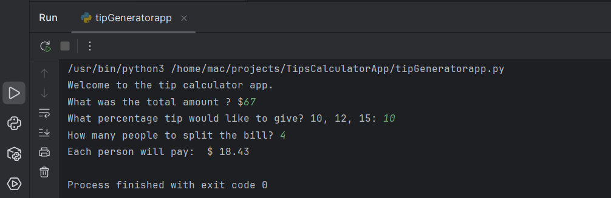

# Tip Calculator

## Overview
This application calculates tips and divides the total bill amount among multiple people at a restaurant. It provides a simple command-line interface that guides users through the process of calculating how much each person should pay, including the tip.

## Features
- Calculate tips based on predefined percentage options (10%, 12%, or 15%)
- Split the total bill (including tip) among multiple people
- Display the amount each person needs to pay, rounded to two decimal places

## Installation
No additional packages are required to run this application. It uses Python's built-in functions only.

## Usage
Run the application using Python:

Follow the prompts in the command-line interface:
1. Enter the total bill amount
2. Select a tip percentage (10%, 12%, or 15%)
3. Enter the number of people sharing the bill
4. The application will calculate and display the amount each person should pay

## Example

## How It Works
The application follows these steps:
1. Takes the total bill amount as input
2. Calculates the tip based on the selected percentage
3. Adds the tip to the total bill
4. Divides the total amount by the number of people
5. Rounds the result to two decimal places
6. Displays the amount each person should pay

## Project Information
- **Author**: Macuei Mathiang
- **Version**: 1.1
- **Date**: July 13, 2021

## License
This project is licensed under the MIT License - see the LICENSE file for details.

## Contributing
Contributions are welcome! Please feel free to submit a Pull Request.

1. Fork the repository
2. Create your feature branch (`git checkout -b feature/amazing-feature`)
3. Commit your changes (`git commit -m 'Add some amazing feature'`)
4. Push to the branch (`git push origin feature/amazing-feature`)
5. Open a Pull Request

## Contact
If you have any questions or suggestions, please open an issue in this repository.

---
*This README was last updated on May 2025*